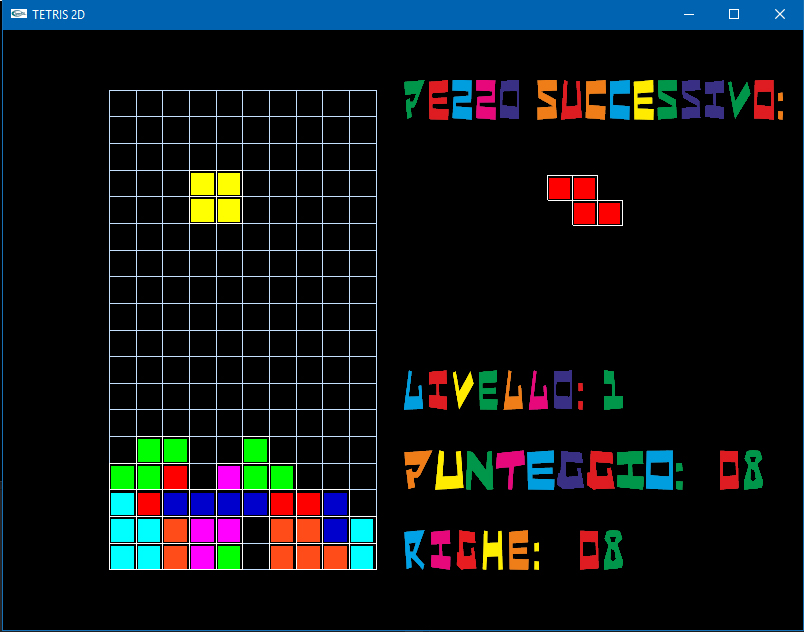

# TetrisRepo

Year: 2013-14

Tetris 2D in 3D is an OpenGL game made by Federico Forlini and Paolo Carrara.
The game support 3D Stereoscopic and it was originally built for the treatment of amblyopia.

This project is made using Glut, SOIL and Irrklang libraries.

 
